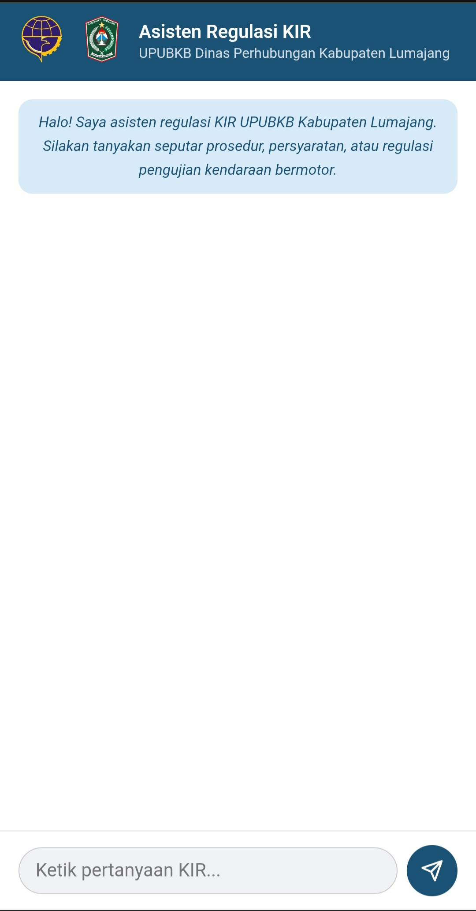
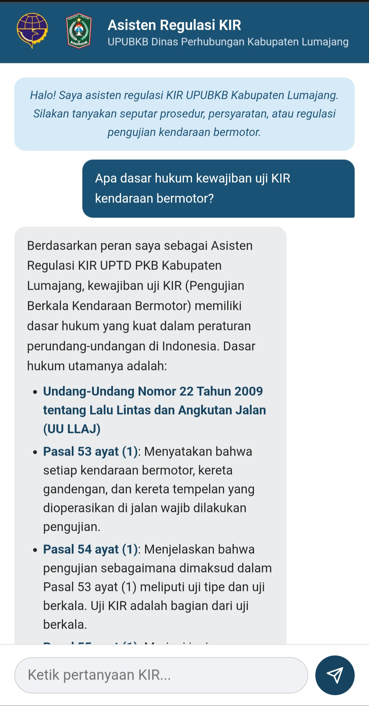
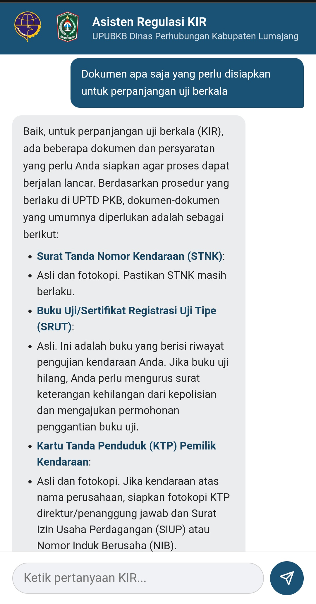

# 🚗 Asisten Regulasi KIR

Chatbot berbasis AI untuk membantu masyarakat dan petugas **UPTD PKB (Unit Pelaksana Teknis Daerah Pengujian Kendaraan Bermotor) Dinas Perhubungan Kabupaten Lumajang** dalam memahami regulasi, prosedur, dan persyaratan pengujian kendaraan bermotor (KIR).

> Final Project — AI Productivity and AI API Integration for Developers  
> Organized by **Hacktiv8** | Supported by Google.org, AVPN, dan Asian Development Bank

---

## 📸 Tampilan Antarmuka

| Halaman Awal | Percakapan 1 | Percakapan 2 |
|:---:|:---:|:---:|
|  |  |  |

---

## ✨ Fitur

- **Multi-turn conversation** — chatbot mengingat konteks percakapan dalam satu sesi
- **Domain-specific knowledge** — mencakup dasar hukum (UU No. 22 Tahun 2009 tentang LLAJ, PM Perhubungan No. 133 Tahun 2015), item pengujian teknis, prosedur uji berkala, dan persyaratan dokumen KIR
- **Markdown rendering** — respons AI dengan bold, heading, dan list ditampilkan rapi
- **Mobile-first UI** — dioptimalkan untuk perangkat mobile
- **Persona formal** — menjawab dengan bahasa Indonesia formal sesuai konteks instansi pemerintahan
- **Temperature rendah (0.3)** — output akurat dan konsisten untuk konteks regulasi

---

## 🛠️ Teknologi

| Komponen | Teknologi |
|---|---|
| Backend | Node.js, Express |
| AI Model | Google Gemini 2.5 Flash |
| Frontend | Vanilla JavaScript, HTML, CSS |
| Package Manager | pnpm |
| Konfigurasi | dotenv |

---

## 📁 Struktur File

```
kir-chatbot/
├── public/
│   ├── index.html       # Halaman utama antarmuka chatbot
│   ├── script.js        # Logika frontend: fetch API, render markdown, multi-turn
│   └── style.css        # Styling mobile-first
├── dokumentasi/
│   ├── 1.jpg            # Screenshot tampilan awal
│   ├── 2.jpg            # Screenshot percakapan 1
│   └── 3.jpg            # Screenshot percakapan 2
├── index.js             # Backend Express + integrasi Gemini AI
├── .env                 # API key (tidak dicommit)
├── .gitignore
└── package.json
```


## ⚖️ Dasar Hukum yang Dikuasai Chatbot

- UU No. 22 Tahun 2009 tentang Lalu Lintas dan Angkutan Jalan (LLAJ)
- PP No. 55 Tahun 2012 tentang Kendaraan
- PM Perhubungan No. 133 Tahun 2015 tentang Pengujian Berkala Kendaraan Bermotor
- PM Perhubungan No. 19 Tahun 2021 tentang Pengujian Berkala Kendaraan Bermotor
- PM Perhubungan No. 156 Tahun 2016 tentang Kompetensi Penguji Kendaraan Bermotor

---

## 👤 Pengembang

**UPUBKB Dinas Perhubungan Kabupaten Lumajang**  
Jawa Timur, Indonesia
